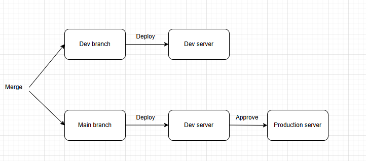

Cách set up luồng cicd cho môi trường dev và production

Khi thiết lập luồng CI/CD trên AWS CodePipeline cho môi trường dev và production, bạn có thể chọn tạo 1 pipeline duy nhất hoặc 2 pipeline riêng biệt. Dưới đây là ưu nhược điểm của từng cách để bạn cân nhắc:

1. Tạo 1 Pipeline Cho Cả Dev và Production
Ưu điểm
Quản lý đơn giản: Chỉ cần theo dõi và bảo trì một pipeline duy nhất.

Tự động liền mạch: Quá trình từ dev đến production được kết nối liên tục trong cùng pipeline, phù hợp với workflow có bước approval giữa dev và prod.

Tiết kiệm chi phí: Ít resource quản lý hơn, giảm phí dịch vụ (một số trường hợp, số lượng pipeline có thể ảnh hưởng đến chi phí).

Nhược điểm
Khó kiểm soát khi lỗi: Nếu pipeline bị lỗi ở môi trường dev sẽ ảnh hưởng đến toàn pipeline.

Phức tạp trong cấu hình: Cần thêm bước quản lý điều kiện (conditional actions) để xử lý deployment riêng cho dev và prod trong cùng pipeline.

Khó mở rộng: Rất lớn hoặc phức tạp khi thêm nhiều môi trường khác (staging, testing...).

2. Tạo 2 Pipeline Riêng Biệt Cho Dev và Production
Ưu điểm
Tách biệt rõ ràng: Mỗi pipeline phục vụ riêng một môi trường, dễ theo dõi, vận hành và xử lý sự cố riêng biệt.

An toàn hơn: Lỗi ở pipeline dev không ảnh hưởng đến pipeline production.

Dễ dàng mở rộng: Khi có nhiều môi trường thì pipeline cho từng môi trường rất linh hoạt.

Kiểm soát quyền riêng biệt: Dễ quản lý phân quyền truy cập pipeline và thông tin nhạy cảm theo môi trường.

Nhược điểm
Quản lý phức tạp hơn: Cần duy trì nhiều pipeline, dễ bị rối khi có nhiều pipeline.

Chi phí có thể cao hơn: AWS tính phí dựa trên số lượng pipeline và resource sử dụng.

Cần phối hợp giữa các pipeline: Ví dụ pipeline production phải chờ pipeline dev hoàn thành và trigger thủ công hoặc tự động.

##### Cách triển khai 1 pipeline

Tóm tắt luồng workflow:

Developer push/merge vào dev → trigger pipeline để build-test-deploy lên dev env → QA kiểm thử.

Khi có sự kiện merge vào main (hoặc đánh tag) → trigger pipeline để build-test (có thể deploy lên dev env) → yêu cầu manual approval → deploy lên production.

Để xử lý luồng trên có thể tạo Pipeline đa nhánh (multibranch pipeline) hoặc pipeline có điều kiện (conditional stages) 

