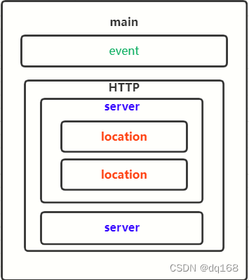

# Nginx

Xác định vị trí thư mục cấu hình và file cấu hình nginx: Ps aux | grep nginx -> tìm file binary của nginx

Hoặc whereis nginx

Sau đó lấy đường dẫn tìm được thêm option -V, file cấu hình nằm ở mục - - conf-path. Thường là file cấu hình là /etc/nginx/nginx.conf


### 1. Cấu trúc file cấu hình nginx.conf



- main: Khối (context) ngoài cùng, chứa các chỉ thị chung cho toàn bộ Nginx (như user, worker_processes, pid...).
- event: Là khối con nằm trong main context, quy định cách Nginx xử lý các kết nối mạng (như worker_connections...).
- HTTP: Khối lớn chứa các chỉ thị xử lý các yêu cầu HTTP; bên trong có thể có nhiều server block.
- server: Mỗi khối server đại diện cho một “virtual host”, xử lý theo từng domain/website. Có thể có nhiều block server trong http. Một khối HTTP có thể chứa nhiều server.
- location: Nằm trong server, dùng để quy định các quy tắc cho từng đường dẫn cụ thể hoặc kiểu file. Một server có thể có nhiều khối location, quy định chi tiết cách Nginx xử lý request tương ứng với từng URL hoặc điều kiện.

Trong thực tế triển khai, thông thường không đưa trực tiếp các block server vào file nginx.conf. Thay vào đó, nên tạo các file cấu hình riêng biệt cho mỗi server block (mỗi domain/website), rồi sử dụng chỉ thị include để nạp các file này vào.
Cấu trúc chuẩn: 
- Trên Ubuntu/Debian, server block được đặt trong thư mục /etc/nginx/sites-available/, sau đó tạo symlink sang /etc/nginx/sites-enabled/. Import vào Nginx thông qua chỉ thị include /etc/nginx/sites-enabled/*
- Trên CentOS server block được đặt trong thư mục /etc/nginx/conf.d/, mỗi file tương ứng cho 1 site và được import vào Nginx thông qua chỉ thị include /etc/nginx/conf.d/*.conf trong nginx.conf.

Ví dụ mẫu:

##### a. Triển khai trực tiếp server block trong file /etc/nginx.conf
```yaml
user www-data;
worker_processes auto;
pid /run/nginx.pid;

events {
    worker_connections 1024;
}

http {
    include       /etc/nginx/mime.types;
    default_type  application/octet-stream;
    sendfile        on;
    keepalive_timeout  65;

    server {
        listen 80;
        server_name example.com;
        
        location / {
            root /var/www/html;
            index index.html index.htm;
        }
    }
    server {
        listen 80;
        server_name jenkins.elroydevops.tech;
        location / {
            proxy_pass http://jenkins.elroydevops.tech:8080; #forward từ jenkins.elroydevops.tech:80 sang jenkins.elroydevops.tech:8080
            proxy_http_version 1.1;
            proxy_set_header Upgrade $http_upgrade;
            proxy_set_header Connection keep-alive;
            proxy_set_header Host $host;
            proxy_cache_bypass $http_upgrade;
            proxy_set_header X-Forwarded-For $proxy_add_x_forwarded_for;
            proxy_set_header X-Forwarded-Proto $scheme;
        }
}

}
```
##### b. Triển khai server block thông qua chỉ thị include

File nginx.conf (đường dẫn: /etc/nginx/nginx.conf)

```yaml
user www-data;
worker_processes auto;
pid /run/nginx.pid;

events {
    worker_connections 1024;
}

http {
    include       /etc/nginx/mime.types;
    default_type  application/octet-stream;
    sendfile        on;
    keepalive_timeout  65;

    # Include all server blocks trong thư mục conf.d/
    include /etc/nginx/conf.d/*.conf;
}
```
File server block riêng (ví dụ: /etc/nginx/conf.d/example.com.conf)
```
server {
    listen 80;
    server_name example.com www.example.com;

    root /var/www/example.com/html;
    index index.html index.htm;

    location / {
        try_files $uri $uri/ =404;
    }
}
```

### 2. Nginx đóng vai trò là reverse proxy

Khi Nginx là reverse proxy có thể dùng 1 trong 2 block
- http: nếu cần cân bằng tải cho web/app (HTTP/HTTPS)
- stream: nếu cần cân bằng tải cho database, game server, API server (TCP/UDP)

Khác biệt giữa 2 chế độ là http có thể chỉnh sửa header, URL, cookie, cache, SSL, còn stream không can thiệp nội dung gói tin

##### Example stream block:
```yaml
user nginx;
worker_processes auto;

events {
    worker_connections 1024;
}
stream { #Đây là cấu hình cho Nginx ở chế độ stream, dùng để cân bằng tải các kết nối TCP (khác với HTTP/HTTPS thông thường).
    upstream kubernetes { #Định nghĩa một nhóm các server backend mà Nginx sẽ phân phối kết nối đến.
        server 10.5.88.220:6443 max_fails=3 fail_timeout=30s;
        server 10.5.89.29:6443 max_fails=3 fail_timeout=30s;
        server 10.5.90.187:6443 max_fails=3 fail_timeout=30s;
    }
    # Server proxy TCP cho kubernetes
    server {
        listen 6443; #Nginx sẽ lắng nghe (listen) các kết nối đến trên cả hai port 6443 và 443 (TCP).
        listen 443;
        proxy_pass kubernetes; #Khi có kết nối đến, Nginx sẽ chuyển tiếp (proxy) kết nối đó đến một trong các server được định nghĩa trong upstream kubernetes.
    }
    # Server proxy UDP cho ứng dụng khác (VD: game server, syslog...)
    server {
        listen 514 udp;
        proxy_pass 192.168.1.150:514;
    }
}
```


##### Example http block:
```yaml
http {
    upstream backend {
        server 192.168.1.101;
        server 192.168.1.102;
        server 192.168.1.103;
    }

    server {
        listen 80;
        server_name example.com www.example.com;

        location / {
            proxy_set_header Host $host;
            proxy_set_header X-Real-IP $remote_addr;
            proxy_set_header X-Forwarded-For $proxy_add_x_forwarded_for;
            proxy_set_header X-Forwarded-Proto $scheme;
            proxy_pass http://backend;
        }
    }

    server {
        listen 443 ssl;
        server_name gitlab.tuna-devops.site;
    
        ssl_certificate     /etc/letsencrypt/live/gitlab.tuna-devops.site/fullchain.pem;
        ssl_certificate_key /etc/letsencrypt/live/gitlab.tuna-devops.site/privkey.pem;
    
        location / {
            proxy_pass http://192.168.102.64:80;
            proxy_http_version 1.1;
            proxy_set_header Upgrade $http_upgrade;
            proxy_set_header Connection keep-alive;
            proxy_set_header Host $host;
            proxy_cache_bypass $http_upgrade;
            proxy_set_header X-Forwarded-For $proxy_add_x_forwarded_for;
            proxy_set_header X-Forwarded-Proto $scheme;
        }
}

}
```
### 3. Tạo HTTPS cho website bằng certbot
#### 1. Cài đặt Certbot
```
sudo apt update  
sudo apt install certbot python3-certbot-nginx -y
```

Certbot sẽ lưu cert tại /etc/letsencrypt/live/ và tự động cấu hình Nginx.
​
#### 2. Lấy chứng chỉ và cấu hình HTTPS
Chạy lệnh Certbot với plugin Nginx
```
sudo certbot --nginx -d <domain>
```
Nhập email, đồng ý terms.

Chọn redirect HTTP sang HTTPS (khuyến nghị).
Certbot tự thêm server block port 443, cập nhật config vào file cấu hình

Lưu ý khi cài đặt:
- Server cần mở port 80 để tạo challenge file tạm thời
- Server block trong Nginx config phải có khai báo server_name trùng với <domain> trong câu lệnh certbot để certbot biết block nào cần modify, từ đó mới tự động chỉnh sửa và thêm SSL được

#### 3. Lenh lam viec voi cert

certbot certificates -d <domain> -> check status cua cert
#### 3. Xử lý lỗi Certbot không renew được cert
- Nguyên nhân lỗi: Chứng chỉ monitor.wnew25.com ban đầu được cấu hình renew bằng plugin nginx (authenticator = nginx trong file renewal), nên Certbot cố parse full cấu hình Nginx để tự tạo location challenge.
- Cấu hình Nginx của bạn khá phức tạp (Lua, include nhiều file, reverse proxy, không có root), khiến Certbot:
  - Lúc thì báo không parse được /etc/nginx/nginx.conf hoặc “No nginx http block found”.
  - Lúc thì rơi vào trạng thái đòi webroot (MissingCommandlineFlag: Input the webroot...), vì nó không xác định được chỗ để đặt file challenge.
- Nginx -t vẫn OK vì Nginx chấp nhận config, nhưng parser của Certbot “khó tính” hơn và không hiểu hết các directive / cấu trúc đặc biệt, dẫn tới renew fail.

- Cách xử lý:
    - Tạo webroot riêng cho Let’s Encrypt, ví dụ /var/www/letsencrypt, chỉ dùng để phục vụ đường dẫn /.well-known/acme-challenge/: `mkdir -p /var/www/letsencrypt`
    - Thêm location phục vụ ACME challenge trong server block của monitor.wnew25.com (port 80), trỏ root của location này về /var/www/letsencrypt, nên mọi request kiểu `http://monitor.wnew25.com/.well-known/acme-challenge/...` đều được Nginx serve từ thư mục đó.
      - Tạo file /etc/nginx/snippets/letsencrypt.conf:
        ```
        location ^~ /.well-known/acme-challenge/ {
            default_type "text/plain";
            root /var/www/letsencrypt;
        }
        ```
      - Trong block server listen 80 của monitor.wnew25.com, include nó:
        
        ```
        server {
            listen 80;
            server_name monitor.wnew25.com;
        
            include /etc/nginx/snippets/letsencrypt.conf;
        
            # phần còn lại (proxy_pass / redirect...) để nguyên
        }
        ```

      - Kiểm tra và reload Nginx: `sudo systemctl reload nginx` 

    - Chạy Certbot với chế độ webroot, chỉ rõ `--webroot -w /var/www/letsencrypt` và `-d monitor.wnew25.com` để Certbot tạo file challenge vào đúng thư mục này, Let’s Encrypt truy cập được, nên cấp/gia hạn cert thành công.
        ```
        sudo certbot certonly \
          --webroot -w /var/www/letsencrypt \
          -d monitor.wnew25.com \
          --cert-name monitor.wnew25.com \
          -v
        ```
        ➜ Sau khi lệnh này chạy thành công, Certbot sẽ cập nhật file `/etc/letsencrypt/renewal/monitor.wnew25.com.conf` sang authenticator = webroot và lưu webroot_path
    - Sau lần chạy đó, file renewal được cập nhật sang authenticator = webroot + lưu webroot path, nên về sau certbot renew tự chạy ổn, không còn phụ thuộc parser của plugin nginx nữa.

- Như vậy, lỗi gốc là do Certbot không “hiểu” được cấu hình nginx phức tạp để dùng plugin nginx, và bạn đã fix bằng cách tách hẳn sang cơ chế webroot đơn giản, rõ ràng, giúp việc renew ổn định và ít phụ thuộc vào cấu hình nội bộ của Nginx.
