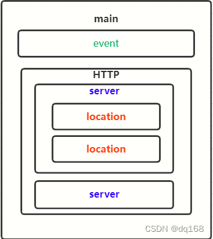

# Nginx

Xác định vị trí thư mục cấu hình và file cấu hình nginx: Ps aux | grep nginx -> tìm file binary của nginx

Hoặc whereis nginx

Sau đó lấy đường dẫn tìm được thêm option -V, file cấu hình nằm ở mục - - conf-path. Thường là file cấu hình là /etc/nginx/nginx.conf


### 1. Cấu trúc file cấu hình nginx.conf



- main: Khối (context) ngoài cùng, chứa các chỉ thị chung cho toàn bộ Nginx (như user, worker_processes, pid...).
- event: Là khối con nằm trong main context, quy định cách Nginx xử lý các kết nối mạng (như worker_connections...).
- HTTP: Khối lớn chứa các chỉ thị xử lý các yêu cầu HTTP; bên trong có thể có nhiều server block.
- server: Mỗi khối server đại diện cho một “virtual host”, xử lý theo từng domain/website. Có thể có nhiều block server trong http. Một khối HTTP có thể chứa nhiều server.
- location: Nằm trong server, dùng để quy định các quy tắc cho từng đường dẫn cụ thể hoặc kiểu file. Một server có thể có nhiều khối location, quy định chi tiết cách Nginx xử lý request tương ứng với từng URL hoặc điều kiện.

Trong thực tế triển khai, thông thường không đưa trực tiếp các block server vào file nginx.conf. Thay vào đó, nên tạo các file cấu hình riêng biệt cho mỗi server block (mỗi domain/website), rồi sử dụng chỉ thị include để nạp các file này vào.
Cấu trúc chuẩn: 
- Trên Ubuntu/Debian, server block được đặt trong thư mục /etc/nginx/sites-available/, sau đó tạo symlink sang /etc/nginx/sites-enabled/. Import vào Nginx thông qua chỉ thị include /etc/nginx/sites-enabled/*
- Trên CentOS server block được đặt trong thư mục /etc/nginx/conf.d/, mỗi file tương ứng cho 1 site và được import vào Nginx thông qua chỉ thị include /etc/nginx/conf.d/*.conf trong nginx.conf.

Ví dụ mẫu:

##### a. Triển khai trực tiếp server block trong file /etc/nginx.conf
```yaml
user www-data;
worker_processes auto;
pid /run/nginx.pid;

events {
    worker_connections 1024;
}

http {
    include       /etc/nginx/mime.types;
    default_type  application/octet-stream;
    sendfile        on;
    keepalive_timeout  65;

    server {
        listen 80;
        server_name example.com;
        
        location / {
            root /var/www/html;
            index index.html index.htm;
        }
    }
    server {
        listen 80;
        server_name jenkins.elroydevops.tech;
        location / {
            proxy_pass http://jenkins.elroydevops.tech:8080; #forward từ jenkins.elroydevops.tech:80 sang jenkins.elroydevops.tech:8080
            proxy_http_version 1.1;
            proxy_set_header Upgrade $http_upgrade;
            proxy_set_header Connection keep-alive;
            proxy_set_header Host $host;
            proxy_cache_bypass $http_upgrade;
            proxy_set_header X-Forwarded-For $proxy_add_x_forwarded_for;
            proxy_set_header X-Forwarded-Proto $scheme;
        }
}

}
```
##### b. Triển khai server block thông qua chỉ thị include

File nginx.conf (đường dẫn: /etc/nginx/nginx.conf)

```yaml
user www-data;
worker_processes auto;
pid /run/nginx.pid;

events {
    worker_connections 1024;
}

http {
    include       /etc/nginx/mime.types;
    default_type  application/octet-stream;
    sendfile        on;
    keepalive_timeout  65;

    # Include all server blocks trong thư mục conf.d/
    include /etc/nginx/conf.d/*.conf;
}
```
File server block riêng (ví dụ: /etc/nginx/conf.d/example.com.conf)
```
server {
    listen 80;
    server_name example.com www.example.com;

    root /var/www/example.com/html;
    index index.html index.htm;

    location / {
        try_files $uri $uri/ =404;
    }
}
```

### 2. Nginx đóng vai trò là reverse proxy

Khi Nginx là reverse proxy có thể dùng 1 trong 2 block
- http: nếu cần cân bằng tải cho web/app (HTTP/HTTPS)
- stream: nếu cần cân bằng tải cho database, game server, API server (TCP/UDP)

Khác biệt giữa 2 chế độ là http có thể chỉnh sửa header, URL, cookie, cache, SSL, còn stream không can thiệp nội dung gói tin

##### Example stream block:
```yaml
user nginx;
worker_processes auto;

events {
    worker_connections 1024;
}
stream { #Đây là cấu hình cho Nginx ở chế độ stream, dùng để cân bằng tải các kết nối TCP (khác với HTTP/HTTPS thông thường).
    upstream kubernetes { #Định nghĩa một nhóm các server backend mà Nginx sẽ phân phối kết nối đến.
        server 10.5.88.220:6443 max_fails=3 fail_timeout=30s;
        server 10.5.89.29:6443 max_fails=3 fail_timeout=30s;
        server 10.5.90.187:6443 max_fails=3 fail_timeout=30s;
    }
    # Server proxy TCP cho kubernetes
    server {
        listen 6443; #Nginx sẽ lắng nghe (listen) các kết nối đến trên cả hai port 6443 và 443 (TCP).
        listen 443;
        proxy_pass kubernetes; #Khi có kết nối đến, Nginx sẽ chuyển tiếp (proxy) kết nối đó đến một trong các server được định nghĩa trong upstream kubernetes.
    }
    # Server proxy UDP cho ứng dụng khác (VD: game server, syslog...)
    server {
        listen 514 udp;
        proxy_pass 192.168.1.150:514;
    }
}
```


##### Example http block:
```yaml
http {
    upstream backend {
        server 192.168.1.101;
        server 192.168.1.102;
        server 192.168.1.103;
    }

    server {
        listen 80;
        server_name example.com www.example.com;

        location / {
            proxy_set_header Host $host;
            proxy_set_header X-Real-IP $remote_addr;
            proxy_set_header X-Forwarded-For $proxy_add_x_forwarded_for;
            proxy_set_header X-Forwarded-Proto $scheme;
            proxy_pass http://backend;
        }
    }

    server {
        listen 443 ssl;
        server_name gitlab.tuna-devops.site;
    
        ssl_certificate     /etc/letsencrypt/live/gitlab.tuna-devops.site/fullchain.pem;
        ssl_certificate_key /etc/letsencrypt/live/gitlab.tuna-devops.site/privkey.pem;
    
        location / {
            proxy_pass http://192.168.102.64:80;
            proxy_http_version 1.1;
            proxy_set_header Upgrade $http_upgrade;
            proxy_set_header Connection keep-alive;
            proxy_set_header Host $host;
            proxy_cache_bypass $http_upgrade;
            proxy_set_header X-Forwarded-For $proxy_add_x_forwarded_for;
            proxy_set_header X-Forwarded-Proto $scheme;
        }
}

}
```
### 3. Tạo HTTPS cho website bằng certbot
#### 1. Cài đặt Certbot
```
sudo apt update  
sudo apt install certbot python3-certbot-nginx -y
```

Certbot sẽ lưu cert tại /etc/letsencrypt/live/ và tự động cấu hình Nginx.
​
#### 2. Lấy chứng chỉ và cấu hình HTTPS
Chạy lệnh Certbot với plugin Nginx
```
sudo certbot --nginx -d <domain>
```
Nhập email, đồng ý terms.

Chọn redirect HTTP sang HTTPS (khuyến nghị).
Certbot tự thêm server block port 443, cập nhật config vào file cấu hình

Lưu ý khi cài đặt:
- Server cần mở port 80 để tạo challenge file tạm thời
- Server block trong Nginx config phải có khai báo server_name trùng với <domain> trong câu lệnh certbot để certbot biết block nào cần modify, từ đó mới tự động chỉnh sửa và thêm SSL được

#### 3. Lenh lam viec voi cert

certbot certificates -d <domain> -> check status cua cert

#### 4. Nguyên lý hoạt động

Nguyên nhân
Certbot đang dùng mode standalone — nó tự spin up một web server tạm trên port 80 để handle challenge. Nhưng port 80 đang bị Nginx (hoặc app khác) chiếm, nên Let's Encrypt gọi vào .well-known/acme-challenge/... lại nhận được response của app thay vì của Certbot.
Let's Encrypt → GET /.well-known/acme-challenge/xxx
                → Nginx nhận → forward về app → trả về HTML của Next.js ❌

Fix: Chuyển sang mode webroot
Thay vì certbot tự chạy web server, nó ghi file vào thư mục và để Nginx serve:
1. Cập nhật nginx.conf — thêm block serve challenge
nginxserver {
    listen 80;
    server_name pms.icon-as.cz;

    # Ưu tiên serve challenge files trước
    location /.well-known/acme-challenge/ {
        root /var/www/certbot;
    }

    location / {
        return 301 https://$host$request_uri;
        # hoặc proxy_pass nếu chưa có SSL
    }
}
2. Mount volume vào Nginx container
yamlservices:
  nginx:
    image: nginx:alpine
    volumes:
      - ./certbot/www:/var/www/certbot   # thêm dòng này
      - ./nginx.conf:/etc/nginx/conf.d/default.conf

  certbot:
    image: certbot/certbot
    volumes:
      - ./certbot/www:/var/www/certbot
      - ./certbot/conf:/etc/letsencrypt
3. Request cert lại bằng --webroot
bashdocker compose run --rm certbot certonly \
  --webroot \
  -w /var/www/certbot \
  -d pms.icon-as.cz \
  --email you@example.com \
  --agree-tos

Flow đúng sau khi fix
Let's Encrypt → GET /.well-known/acme-challenge/xxx
               → Nginx nhận
               → serve file từ /var/www/certbot ✅
               → Let's Encrypt xác nhận → cấp cert
               
Để cấp cert, Let's Encrypt cần chứng thực bạn thực sự sở hữu domain. Họ dùng giao thức ACME (Automatic Certificate Management Environment). ACME có 2 loại là HTTP challenge và DNS challenge

Flow hoạt động
```
1. Certbot nói với Let's Encrypt: "Tôi muốn cert cho pms.icon-as.cz"

2. Let's Encrypt trả về một "challenge token", ví dụ:
   token = "ino4nBz9FVezrSVki38wCXh98NhABGum0ks"

3. Certbot đặt file đó tại:
   /var/www/certbot/.well-known/acme-challenge/ino4nBz9FVezrSVki38...

4. Let's Encrypt gọi HTTP vào:
   GET http://pms.icon-as.cz/.well-known/acme-challenge/ino4nBz9FVezrSVki38...

5. Nếu đọc được file đúng nội dung → "Máy chủ này kiểm soát domain đó" → cấp cert ✅
   Nếu không đọc được → từ chối ❌

6. Logic của Certbot: "Nếu bạn đặt được file lên server đang chạy domain đó → chứng minh được bạn control server → sở hữu domain"
```
DNS challenge hoạt động tương tự HTTP challenge — thay vì đặt file, bạn tạo TXT record trên DNS. Hữu ích khi server không public internet (internal, firewall...).

Lưu ý .well-known là một RFC chuẩn (RFC 8615) — quy ước để các service đặt metadata/file ở một path có thể đoán trước được. Nhiều thứ khác cũng dùng convention này, VD .well-known/openid-configuration

Ví dụ chạy 1 container với DNS challenge để xin cert: `docker compose run --rm certbot certonly --manual --preferred-challenges dns -d pms.icon-as.cz`

#### 5. Xử lý lỗi Certbot không renew được cert
- Nguyên nhân lỗi: Chứng chỉ monitor.wnew25.com ban đầu được cấu hình renew bằng plugin nginx (authenticator = nginx trong file renewal), nên Certbot cố parse full cấu hình Nginx để tự tạo location challenge.
- Cấu hình Nginx của bạn khá phức tạp (Lua, include nhiều file, reverse proxy, không có root), khiến Certbot:
  - Lúc thì báo không parse được /etc/nginx/nginx.conf hoặc “No nginx http block found”.
  - Lúc thì rơi vào trạng thái đòi webroot (MissingCommandlineFlag: Input the webroot...), vì nó không xác định được chỗ để đặt file challenge.
- Nginx -t vẫn OK vì Nginx chấp nhận config, nhưng parser của Certbot “khó tính” hơn và không hiểu hết các directive / cấu trúc đặc biệt, dẫn tới renew fail.

- Cách xử lý:
    - Tạo webroot riêng cho Let’s Encrypt, ví dụ /var/www/letsencrypt, chỉ dùng để phục vụ đường dẫn /.well-known/acme-challenge/: `mkdir -p /var/www/letsencrypt`
    - Thêm location phục vụ ACME challenge trong server block của monitor.wnew25.com (port 80), trỏ root của location này về /var/www/letsencrypt, nên mọi request kiểu `http://monitor.wnew25.com/.well-known/acme-challenge/...` đều được Nginx serve từ thư mục đó.
      - Tạo file /etc/nginx/snippets/letsencrypt.conf:
        ```
        location ^~ /.well-known/acme-challenge/ {
            default_type "text/plain";
            root /var/www/letsencrypt;
        }
        ```
      - Trong block server listen 80 của monitor.wnew25.com, include nó:
        
        ```
        server {
            listen 80;
            server_name monitor.wnew25.com;
        
            include /etc/nginx/snippets/letsencrypt.conf;
        
            # phần còn lại (proxy_pass / redirect...) để nguyên
        }
        ```

      - Kiểm tra và reload Nginx: `sudo systemctl reload nginx` 

    - Chạy Certbot với chế độ webroot, chỉ rõ `--webroot -w /var/www/letsencrypt` và `-d monitor.wnew25.com` để Certbot tạo file challenge vào đúng thư mục này, Let’s Encrypt truy cập được, nên cấp/gia hạn cert thành công.
        ```
        sudo certbot certonly \
          --webroot -w /var/www/letsencrypt \
          -d monitor.wnew25.com \
          --cert-name monitor.wnew25.com \
          -v
        ```
        ➜ Sau khi lệnh này chạy thành công, Certbot sẽ cập nhật file `/etc/letsencrypt/renewal/monitor.wnew25.com.conf` sang authenticator = webroot và lưu webroot_path
    - Sau lần chạy đó, file renewal được cập nhật sang authenticator = webroot + lưu webroot path, nên về sau certbot renew tự chạy ổn, không còn phụ thuộc parser của plugin nginx nữa.

- Như vậy, lỗi gốc là do Certbot không “hiểu” được cấu hình nginx phức tạp để dùng plugin nginx, và bạn đã fix bằng cách tách hẳn sang cơ chế webroot đơn giản, rõ ràng, giúp việc renew ổn định và ít phụ thuộc vào cấu hình nội bộ của Nginx.

---

Ví dụ cấu hình nginx để forward request đến localhost:3000 và redirect từ http sang https
```
server {
    server_name integration.googames.io;
    location / {
        proxy_pass http://127.0.0.1:3000;
        proxy_http_version 1.1;
        proxy_set_header Host $host;
        proxy_set_header X-Real-IP $remote_addr;
        proxy_set_header X-Forwarded-For $proxy_add_x_forwarded_for;
        proxy_set_header X-Forwarded-Proto $scheme;
    }

    listen 443 ssl; # managed by Certbot
    ssl_certificate /etc/letsencrypt/live/integration.googames.io/fullchain.pem; # managed by Certbot
    ssl_certificate_key /etc/letsencrypt/live/integration.googames.io/privkey.pem; # managed by Certbot
    include /etc/letsencrypt/options-ssl-nginx.conf; # managed by Certbot
    ssl_dhparam /etc/letsencrypt/ssl-dhparams.pem; # managed by Certbot

}

server {
    if ($host = integration.googames.io) {
        return 301 https://$host$request_uri;
    } # managed by Certbot


    listen 80;
    server_name integration.googames.io;
    return 404; # managed by Certbot
```

---

Ví dụ tắt cors trên nginx
```
location ~* \.(woff|woff2|ttf|eot|otf)$ {
    proxy_pass http://127.0.0.1:9084;  # Proxy qua backend CÓ file
    proxy_hide_header Access-Control-Allow-Origin;
    
    add_header Access-Control-Allow-Origin * always;
    add_header Access-Control-Allow-Methods "GET, OPTIONS" always;
    expires 1y;
    access_log off;
}
```

---


Origin = scheme + domain + port. VD http://app.com thì scheme là http, domain là app.com và port là 80. Lưu ý app.com/api có cùng orgin với app.com/auth, do origin không tính đến Path, query string (?foo=bar), và fragment (#section). Còn app.example.com và api.example.com khác origin tuy cùng domain gốc example.com, nhưng subdomain khác nhau → hostname khác


Cross-origin request là tình huống rất phổ biến trong thực tế. Ví dụ 
- Frontend (app.example.com) và backend (api.other.com) chạy trên domain khác nhau. Người dùng mở app.example.com, JavaScript trên trang đó gọi fetch("https://api.other.com/users") để lấy dữ liệu
- Trang web dùng API của bên thứ ba — ví dụ myshop.com gọi đến api.stripe.com để xử lý thanh toán.
- Microservices — app.com gọi đến auth.app.com, payment.app.com (subdomain khác = khác origin).
- Môi trường dev/prod tách biệt — frontend chạy ở localhost:3000 gọi đến backend ở localhost:8080 (cùng hostname nhưng khác port = khác origin).


Mặc định trình duyệt chặn tất cả cross-origin request. Đây là cơ chế bảo vệ người dùng, tránh trường hợp một trang web độc hại tự động gọi API ngân hàng của bạn bằng cookie đang đăng nhập.


CORS (Cross-Origin Resource Sharing) là cơ chế bảo mật của trình duyệt, kiểm soát việc một trang web có thể yêu cầu tài nguyên từ một domain khác hay không.


Khi gửi trình duyệt gửi cross-origin request, nó sẽ tự động thêm header Origin (1 request có thể có nhiều header) vào request để báo cho server biết request đến từ đâu. Đây là "forbidden header" được trình duyệt kiểm soát hoàn toàn, không thể xóa hay sửa và chỉ xuất hiện khi gửi cross-origin request
```
GET /api/users HTTP/1.1
Host: api.other.com                        # Header 1
Origin: http://app.example.com               # Header 2  
User-Agent: Mozilla/5.0...                 # Header 3
Accept: font/ttf,*/*;q=0.9                # Header 4
Referer: https://bot3-admin...             # Header 5
Cache-Control: max-age=0                  # Header 6
```

Server nhận request, kiểm tra header Origin và đối chiếu với danh sách cho phép, rồi trả về header `Access-Control-Allow-Origin: <allowed_origin>` để cho phép hoặc không trả về header `Access-Control-Allow-Origin` → trình duyệt chặn response.

Lưu ý bảo mật: Origin giúp server biết request đến từ đâu, nhưng không nên dùng làm cơ chế xác thực duy nhất vì nó chỉ đáng tin khi đến từ trình duyệt — curl hay Postman có thể giả mạo Origin tùy ý. Vì vậy không nên dùng CORS thay thế cho xác thực API thật sự.

Có 2 loại request:
- Request đơn giản — GET, HEAD, hoặc POST với content-type thông thường. Trình duyệt gửi thẳng, kèm header Origin. Server trả về Access-Control-Allow-Origin để cho phép hoặc không.
- Preflight request — các method "nguy hiểm" như PUT, DELETE, hoặc request có custom header. Trình duyệt gửi request OPTIONS hỏi server trước ("tôi có được phép gửi PUT không?"). Nếu server đồng ý mới gửi request thật.


Các header Server có thể trả về:
- Access-Control-Allow-Origin: Domain nào được phép (* = tất cả)
- Access-Control-Allow-Methods: Methods được phép (GET, POST, PUT...)
- Access-Control-Allow-Headers: Custom headers được phép
- Access-Control-Allow-Credentials: Có cho phép cookie/auth không

Nginx thường đóng vai trò reverse proxy — đứng trước server thật và xử lý CORS thay cho backend.
Để xử lý CORS có 2 cách:
- Cách 1: Backend tự gắn CORS header và trả về cho trình duyệt
- Cách 2 — Nginx xử lý CORS thay backend

Nginx chỉ cần thêm config để tự động gắn Access-Control-* header vào mọi response:
```
server {
    listen 80;
    server_name api.other.com;

    location /api/ {
        # Cho phép origin cụ thể
        add_header Access-Control-Allow-Origin "http://app.example.com";
        add_header Access-Control-Allow-Methods "GET, POST, PUT, DELETE";
        add_header Access-Control-Allow-Headers "Authorization, Content-Type";

        # Xử lý preflight request. 
        if ($request_method = OPTIONS) { #Preflight (OPTIONS) được Nginx trả lời luôn, không cần chuyển vào backend.
            add_header Access-Control-Max-Age 3600;
            return 204;
        }

        proxy_pass http://backend:8080;
    }
}
```


Lợi ích khi dùng nginx để xử lý CORS:
- Tách biệt trách nhiệm — backend chỉ lo business logic, Nginx lo networking/security.
- Một chỗ duy nhất — nếu có nhiều backend service (Node.js, Python, Go...), chỉ cần config CORS ở Nginx một lần thay vì sửa từng service.
- Hiệu năng — preflight OPTIONS được Nginx trả lời ngay, không tốn tài nguyên backend.


Lưu  ý 2: font luôn trigger CORS check (dù cho cùng hay khác origin), khác với  hoặc CSS thông thường chỉ cần CORS khi khác origin. Đây là font-specific security feature của browser.
