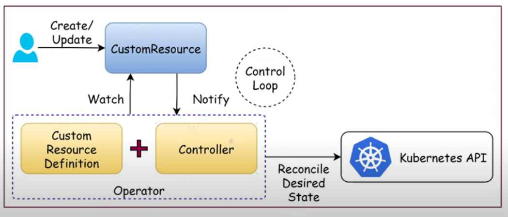

Giải thích chi tiết sự khác nhau giữa các trường cấu hình etcd
1. --advertise-client-urls
Đây là địa chỉ mà node etcd sẽ thông báo cho các client (ví dụ: kube-apiserver, công cụ quản trị, hoặc các node khác) để kết nối tới node etcd này.

Địa chỉ này sẽ xuất hiện trong thông tin cluster, giúp các thành phần khác biết endpoint nào để truy cập dịch vụ etcd của node này.

Thường là IP private của node, port 2379.

2. --listen-client-urls
Là danh sách các địa chỉ mà etcd sẽ mở (listen) để nhận kết nối từ client.

Thường bao gồm cả 127.0.0.1 (localhost) và IP private thực của máy.

Nếu bạn muốn etcd chỉ nhận kết nối từ localhost, chỉ cần để 127.0.0.1. Nếu muốn các node khác truy cập được, phải thêm IP private.

3. --initial-advertise-peer-urls
Là địa chỉ mà node etcd này sẽ thông báo cho các peer (các thành viên khác trong cụm etcd) để các peer biết cách kết nối peer-to-peer với node này.

Dùng trong quá trình khởi tạo cluster hoặc khi thêm node mới.

Thường là IP private của node, port 2380.

4. --listen-peer-urls
Là danh sách các địa chỉ mà etcd sẽ mở để nhận kết nối từ các peer (các node etcd khác).

Địa chỉ này phải là IP mà các node khác trong cụm etcd có thể truy cập được.

Thường là IP private của node, port 2380.

5. --initial-cluster
Là danh sách tất cả các thành viên ban đầu của cụm etcd, định dạng name=peerURL, phân tách bằng dấu phẩy.

Giúp các node etcd biết được các peer ban đầu để hình thành cluster và đồng bộ dữ liệu.

Ví dụ:
master1=https://192.168.1.10:2380,master2=https://192.168.1.11:2380,master3=https://192.168.1.12:2380


Tóm tắt:

Các trường advertise dùng để thông báo địa chỉ cho các thành phần khác biết cách kết nối đến node etcd này.

Các trường listen xác định etcd sẽ mở các cổng nào để nhận kết nối.

initial-cluster giúp các node etcd nhận diện nhau và hình thành cluster phân tán.

---
Tại sao các trường này thường có cùng một IP? Có bao giờ khác nhau không?
Thông thường, các trường này sẽ dùng cùng một IP là IP private thực của node etcd (ví dụ: 192.168.1.10) để đảm bảo các thành phần khác và các peer trong cluster đều có thể kết nối đến node này.

Các trường listen- là nơi etcd lắng nghe kết nối; các trường advertise- là địa chỉ mà etcd thông báo cho các thành phần khác biết để kết nối tới nó. Thường, chúng nên giống nhau để tránh nhầm lẫn và lỗi mạng.

Có thể khác nhau trong một số trường hợp đặc biệt:

Nếu node etcd có nhiều interface mạng (multi-homed), bạn có thể muốn etcd chỉ lắng nghe trên một interface nhất định (ví dụ: chỉ trên mạng nội bộ).

Nếu bạn muốn etcd chỉ chấp nhận kết nối client từ localhost nhưng peer từ IP private, bạn có thể cấu hình --listen-client-urls=https://127.0.0.1:2379 và --listen-peer-urls=https://192.168.1.10:2380.

Trong môi trường NAT hoặc cloud, đôi khi địa chỉ quảng bá (advertise) phải là IP public hoặc IP của load balancer, còn listen là IP private.

---

Khi một node (máy chủ) có nhiều địa chỉ IP (multi-homed), việc chọn IP nào để điền vào các trường cấu hình như --advertise-client-urls, --listen-client-urls, --initial-advertise-peer-urls, --listen-peer-urls của etcd hoặc các thành phần control plane trong Kubernetes không phải là tự động mà thường dựa vào quyết định của người quản trị hoặc tham số cấu hình khi khởi tạo cluster.

Nguyên tắc chọn IP
Bạn phải chọn thủ công IP phù hợp nhất cho cluster, thường là IP thuộc interface mạng nội bộ (LAN, private network) mà các node khác trong cluster có thể truy cập được.

Không nên dùng IP public, IP NAT, hoặc IP loopback (127.0.0.1) cho các trường này, trừ khi toàn bộ cluster cùng nằm trên một máy hoặc cùng mạng NAT đặc biệt.

Nếu bạn dùng công cụ như kubeadm, khi chạy lệnh khởi tạo, bạn có thể chỉ định IP mong muốn với tham số như --apiserver-advertise-address=<IP> hoặc sửa manifest etcd để điền đúng IP.

---

Khi bạn dùng Load Balancer (LB) cho API server trong cụm Kubernetes HA, các địa chỉ IP trong các trường cấu hình etcd (như --advertise-client-urls, --listen-client-urls, --initial-advertise-peer-urls, --listen-peer-urls, --initial-cluster) vẫn là IP thực của từng node master, chứ không phải là IP của LB.

Giải thích chi tiết
1. Các trường cấu hình etcd dùng IP nào?
Tất cả các trường này đều phải dùng IP thực (IP private) của từng node master để các node etcd có thể giao tiếp trực tiếp với nhau qua các cổng 2379 và 2380.

Không dùng IP của LB cho các trường này.
LB chỉ dùng để load balance traffic đến kube-apiserver (port 6443), không dùng cho giao tiếp giữa các thành viên etcd.

2. Vì sao không dùng IP LB cho etcd?
LB chỉ phân phối traffic đến API server của các master node (kube-apiserver:6443) cho client bên ngoài hoặc worker node.

etcd là một cluster phân tán, các thành viên (master nodes) cần biết chính xác IP của nhau để đồng bộ dữ liệu, bầu leader, v.v. Việc đi qua LB sẽ phá vỡ logic peer-to-peer của etcd và có thể gây lỗi nghiêm trọng cho cluster.

Các trường này phải là IP mà các node master có thể kết nối trực tiếp với nhau, không đi qua LB.


### Blue-green

Chiến lược blue-green deployment trong Kubernetes cho phép triển khai ứng dụng mới với rủi ro tối thiểu và đảm bảo không bị gián đoạn dịch vụ bằng cách chạy song song hai môi trường "blue" (phiên bản cũ) và "green" (phiên bản mới).

Cách hoạt động
Blue-green deployment vận hành bằng cách:

- "Blue" là môi trường production hiện tại tiếp nhận toàn bộ traffic người dùng.

- Khi có bản cập nhật, triển khai "Green" — chạy song song phiên bản mới nhưng chưa nhận traffic bên ngoài.

- Tiến hành test, kiểm tra các tính năng và performace trên môi trường "Green".

- Khi mọi thứ ổn định, chuyển traffic từ "Blue" sang "Green" bằng cách cập nhật Kubernetes Service selector (hoặc sử dụng công cụ như Istio, Argo Rollouts).

- Nếu phát sinh lỗi, có thể chuyển nhanh traffic ngược về môi trường "Blue" để rollback

K8s không native hỗ trợ blue-green Kubernetes (mặc định chỉ có Recreate Deployment và Rolling Update), chỉ có thể thực hiện manual:

- Tạo deployment "blue" (phiên bản cũ) và service trỏ tới pod có label blue.

- Tạo deployment "green" (phiên bản mới) với pod có label green, chưa nhận traffic.

- Test môi trường green.

- Khi sẵn sàng, cập nhật service selector chuyển traffic sang pods green.

- Nếu lỗi, chuyển selector lại về pods blue.


Ngoài thao tác thủ công, có thể dùng các công cụ phổ biến:

- Istio VirtualService giúp chuyển traffic giữa blue và green bằng weight, canary hoặc trực tiếp.

- Argo Rollouts hoặc Flagger giúp tự động hóa quá trình release và rollback.


Các chiến lược nâng cao cần triển khai thủ công hoặc công cụ hỗ trợ
Blue/Green Deployment: Cần chạy song song 2 Deployment, dịch vụ và chuyển selector hoặc thay đổi weight của ingress để điều phối traffic thủ công.

Canary Deployment: Cần tạo nhiều Deployment riêng biệt cho các phiên bản, sử dụng các công cụ như Argo Rollouts, Flagger hoặc service mesh (Istio) để dần dần chuyển traffic.

A/B Testing, Shadow Deployment: Không phải chức năng gốc; dùng service mesh hoặc gateway để điều phối traffic và lọc, sao chép request.

Best-Effort Controlled Rollout: Không trực tiếp có trong K8s, thường phối hợp với các công cụ tự động hóa dựa trên số liệu giám sát.


---

Service Mesh là một lớp hạ tầng (infrastructure layer) chuyên dụng giúp quản lý và kiểm soát giao tiếp giữa các dịch vụ trong hệ thống Microservices. Nó cung cấp các tính năng quan trọng như bảo mật, cân bằng tải, giám sát, quản lý lưu lượng và xử lý lỗi mà không cần thay đổi mã nguồn ứng dụng.

Cách hoạt động của Service Mesh thường dựa vào mô hình "sidecar proxy": mỗi dịch vụ trong hệ thống sẽ có một proxy riêng chạy bên cạnh (sidecar container) để điều phối toàn bộ lưu lượng mạng giữa các dịch vụ. Các proxy này sẽ chịu trách nhiệm mã hóa, xác thực, cân bằng tải, thử lại khi lỗi, ngắt mạch (circuit breaker) và thu thập số liệu giám sát, giúp việc giao tiếp dịch vụ được an toàn, tin cậy và hiệu quả.

Service Mesh tách biệt các phần quản lý giao tiếp (như bảo mật, định tuyến, giám sát) ra khỏi mã nguồn dịch vụ chính, giúp giảm phức tạp cho developer đồng thời tăng cường khả năng quản lý và vận hành hệ thống lớn với nhiều dịch vụ nhỏ (microservices) một cách linh hoạt và tự động.


### Cách chọn node deploy pod trong Kubernetes


| Tiêu chí                  | nodeSelector                                 | nodeAffinity                                       | taints và tolerations                            |
|---------------------------|----------------------------------------------|---------------------------------------------------|--------------------------------------------------|
| Mục đích chính            | Lựa chọn node dựa trên label đơn giản        | Chọn node theo quy tắc linh hoạt dựa trên label   | Đẩy/đuổi pod khỏi node bằng taint + kiểm tra toleration |
| Cách hoạt động            | Pod chỉ định key-value label phải có         | Định nghĩa điều kiện bắt buộc hoặc ưu tiên label  | Node gắn taint, pod cần có toleration tương ứng   |
| Độ linh hoạt              | Thấp (chỉ match đúng label)                  | Cao (nhiều điều kiện + ưu tiên/bắt buộc)          | Cao (kiểm soát scheduling mạnh hơn)               |
| Tác động scheduling       | Scheduler chỉ deploy pod lên node đúng label | Bắt buộc hoặc ưu tiên node phù hợp                | Pod không có toleration sẽ bị đẩy khỏi node có taint |
| Phạm vi kiểm soát         | Chọn node đơn giản dựa trên label            | Phân bổ pod rất linh hoạt                         | Kiểm soát node cho pod đặc biệt, có thể “cấm” pod |
| Dễ sử dụng                | Đơn giản                                     | Phức tạp hơn, nhiều lựa chọn quy tắc              | Cần cấu hình converged cả node và pod             |
| Ví dụ khai báo            | `nodeSelector: {"disktype": "ssd"}`          | `nodeAffinity` với nhiều điều kiện                 | Node taint & toleration trong pod spec            |


### Kiến trúc một cụm Kubernetes (k8s) có tính khả dụng cao (high availability - HA)

Kiến trúc một cụm Kubernetes (k8s) có tính khả dụng cao (high availability - HA) thường bao gồm các thành phần và thiết kế chính sau:

##### Kiến trúc Control Plane với tính khả dụng cao
- Cấu hình multi-master: sử dụng ít nhất 3 node master (control plane nodes) để tránh điểm lỗi đơn. Các thành phần chính như API server, controller manager và scheduler chạy trên các master node này.

- etcd cluster phân tán: etcd là kho lưu trữ trạng thái của toàn bộ cụm, cần được triển khai thành một cụm riêng biệt với từ 3 đến 5 node để đảm bảo tính nhất quán và chịu lỗi tốt.

Hai mô hình phổ biến:

  + Stacked control plane nodes: etcd cùng chạy trên các node master, dễ quản lý nhưng có thể ảnh hưởng hiệu năng.

  + External etcd cluster: etcd chạy trên các node riêng biệt, tăng hiệu năng và độ ổn định nhưng cần hạ tầng phức tạp hơn.

- Sử dụng load balancer như HAProxy để phân phối yêu cầu API server đến các control plane nodes, đảm bảo không có điểm nghẽn hoặc lỗi đơn. HAProxy được cấu hình như một proxy TCP ở cổng 6443 (cổng mặc định của Kubernetes API server), nó định tuyến các yêu cầu đến nhiều API server trên các node master bằng thuật toán cân bằng tải (như round-robin). Nếu hệ thống có nhiều instance HAProxy để chịu tải cũng như tăng dự phòng, sử dụng Keepalived để cung cấp cơ chế Virtual Router Redundancy Protocol (VRRP), tạo một địa chỉ IP ảo (Virtual IP - VIP) được chia sẻ giữa nhiều node chạy HAProxy -> Giúp phòng tránh downtime nếu một node load balancer bị lỗi mà không gây gián đoạn truy cập API server Kubernetes.

- Các master node hoạt động theo mô hình active-active (API server) và active-standby (controller manager, scheduler) với cơ chế bầu lãnh đạo (leader election).

##### Node worker và các chiến lược HA
- Node worker nên được phân bổ đồng đều qua nhiều vùng sẵn sàng (availability zones) để tránh mất dịch vụ khi vùng đó bị lỗi.

- Node pools cho phép quản lý nhóm node đồng nhất, dễ mở rộng, giúp duy trì sức chịu tải và dự phòng.

- Ứng dụng trong cluster cần chạy nhiều bản sao (replica) để luôn có pod thay thế khi có pod bị lỗi.

##### Các yếu tố khác trong kiến trúc HA
- Triển khai cơ chế tự động mở rộng (autoscaling) cho pod và node để ứng phó với biến động tải.
- Persistent storage phải có khả năng chịu lỗi, dùng hệ thống lưu trữ phân tán hoặc lưu trữ đã được cấu hình replica, tránh mất dữ liệu.
  + Lưu trữ phân tán (Distributed Storage): Giúp dữ liệu được nhân bản trên nhiều node lưu trữ, nếu một node lỗi, dữ liệu vẫn còn trên các node khác. Các hệ thống lưu trữ phân tán phổ biến trong Kubernetes: Ceph RBD, GlusterFS, Rook, OpenEBS, Longhorn. Ceph nổi bật với khả năng cung cấp block storage phân tán, có tính sẵn sàng cao và hỗ trợ dynamic provisioning qua CSI (Container Storage Interface). OpenEBS và Longhorn là các giải pháp lưu trữ native cho Kubernetes, dễ triển khai, tích hợp tốt, phù hợp cho các ứng dụng vừa và nhỏ, có khả năng tự động nhân bản, snapshot, backup dữ liệu.
  + Kubernetes sử dụng PersistentVolume (PV) và PersistentVolumeClaim (PVC) để tách biệt cung cấp lưu trữ và yêu cầu sử dụng. Việc cấu hình StorageClass giúp động cơ lưu trữ có thể tự động cấp phát (dynamic provisioning) các volume theo yêu cầu, tăng tính linh hoạt và khả năng mở rộng.


### Số lượng master node trong cụm Kubernetes
Số lượng master node trong cụm Kubernetes thường được khuyến nghị là số lẻ để đảm bảo nguyên tắc quorum trong quá trình bầu chọn leader và duy trì tính khả dụng cao (HA). Bầu chọn leader giúp đảm bảo chỉ có một thực thể điều khiển duy nhất tại một thời điểm, tránh xung đột thao tác.

Nguyên tắc quorum: Kubernetes dùng thuật toán đồng thuận RAFT cho etcd cluster và các thành phần control plane cần bầu lãnh đạo (leader) điều phối cụm. Quorum là số node tối thiểu phải hoạt động và đồng ý để cluster thực hiện các quyết định nhất quán. Với số master node lẻ, quorum phải lớn hơn một nửa, ví dụ: 3 node -> quorum là 2. Nhờ đó, khi một hoặc một vài node master bị lỗi hoặc mất kết nối, cụm vẫn giữ được quorum, tránh hiện tượng split-brain (chia rẽ trạng thái cluster). Nếu số node là chẵn (ví dụ 2 hoặc 4), thì quorum sẽ bằng nửa số node khiến cluster dễ bị mất quorum khi chỉ mất 1 node, làm cluster không thể bầu leader hoặc thực hiện cập nhật trạng thái.

Trong Kubernetes, quá trình bầu chọn leader diễn ra trong các thành phần control plane, cụ thể là:

- Kube-controller-manager: Trong cluster có thể có nhiều instance chạy kube-controller-manager (để HA), nhưng chỉ có một instance giữ vai trò leader để tránh xung đột khi thực hiện các tác vụ điều khiển cluster như tạo pod, cập nhật trạng thái, xử lý node, v.v.

- Kube-scheduler: Tương tự kube-controller-manager, nhiều instance kube-scheduler có thể chạy nhưng chỉ một scheduler được bầu làm leader để chịu trách nhiệm lên lịch (schedule) pod, tránh tình trạng nhiều scheduler cùng chạy gây xung đột.

- etcd cluster: etcd sử dụng thuật toán Raft để bầu chọn một node etcd làm leader trong cụm. Leader etcd chịu trách nhiệm xử lý các yêu cầu ghi và điều phối sự đồng bộ dữ liệu trên các node etcd còn lại. Lưu ý etcd không hoạt động theo kiểu active-standby thuần túy, mà là một cụm (cluster) phân tán dùng thuật toán đồng thuận Raft:
  + Trong cluster etcd sẽ luôn có một leader tại một thời điểm; các node còn lại là follower.
  + Leader xử lý các yêu cầu ghi (write/update) và đồng bộ trạng thái đến các follower.
  + Các follower nhận bản sao trạng thái, kiểm tra sức khỏe leader và sẵn sàng bầu chọn leader mới khi leader hiện tại gặp sự cố.
  + Khi leader gặp lỗi, các follower tự động tổ chức bầu chọn để chọn ra leader mới (leader election).
  + Các node follower không ở trạng thái standby "thụ động" mà vẫn xử lý các yêu cầu đọc (read) và tham gia đồng bộ, hoạt động liên tục.


Mỗi thành phần control plane có cơ chế leader election riêng và có thể có leader khác nhau trên các node master khác nhau trong cùng một thời điểm. Ví dụ trong một cụm 3 node master, có thể xảy ra trường hợp:
- Controller manager tại node 1 làm leader
- Scheduler tại node 2 làm leader
- Etcd node 3 làm leader.

### Tự động restart Pod khi ConfigMap thay đổi
Trong Kubernetes, Pod sẽ không tự động restart khi ConfigMap thay đổi. Đây là hành vi mặc định vì Kubernetes không có cơ chế tự động khởi động lại Pod khi ConfigMap được cập nhật.

Để đạt được việc tự động restart Pod khi ConfigMap thay đổi, bạn có thể dùng một số cách sau:

- Dùng công cụ bên thứ ba như Reloader: Đây là một Kubernetes Controller chuyên giám sát các ConfigMap và Secret được chỉ định, khi phát hiện thay đổi sẽ tự động khởi động lại Pod (ví dụ qua rollout restart). Bạn chỉ cần cài đặt Reloader và thêm annotation vào Deployment để chỉ định ConfigMap cần giám sát.

- Cách thủ công với Kubernetes:

Cập nhật annotation trong metadata template của Deployment mỗi khi ConfigMap thay đổi để kích hoạt rollout restart:

```
spec:
  template:
    metadata:
      annotations:
        configmap-version: "2"  # tăng giá trị đi kèm mỗi lần ConfigMap thay đổi
```
Hoặc dùng lệnh thủ công để rollout restart:
```
kubectl rollout restart deployment <deployment-name>
```
- Một số công cụ quản lý deployment như Helm có thể hỗ trợ tự động tính toán checksum của ConfigMap rồi dùng checksum đó làm annotation kích hoạt restart khi ConfigMap thay đổi.

Cách thực hiện: Trong template deployment.yaml của Helm, thêm phần annotation chứa checksum của ConfigMap vào phần metadata của Pod template.

Khi nội dung ConfigMap thay đổi, giá trị checksum này sẽ khác đi, dẫn đến thay đổi annotation trên Pod template. Kubernetes coi đó là thay đổi nên sẽ rollout lại Deployment, khởi động lại Pod.

Ví dụ cụ thể trong deployment.yaml của Helm:

```
spec:
  template:
    metadata:
      annotations:
        checksum/config: {{ include (print $.Template.BasePath "/configmap.yaml") . | sha256sum }}
```
Giải thích:

include sẽ lấy template ConfigMap (configmap.yaml),

sha256sum tính toán checksum chuỗi template đó,

checksum này đặt làm annotation, cứ mỗi lần ConfigMap thay đổi thì checksum này thay đổi => Kubernetes sẽ restart Pod.

Một số lưu ý khi áp dụng:

File configmap.yaml trong template Helm phải chứa chính xác content của ConfigMap đang được sử dụng.


Lưu ý: Nếu bạn mount ConfigMap dưới dạng volume, nội dung file sẽ được cập nhật ngay trong container khi Configmap thay đổi, nhưng nếu mount dưới dạng biến môi trường thì không tự cập nhật.


## Ingress


#### Một hệ thống Kubernetes thông thường sử dụng cả LoadBalancer và Ingress Controller để điều phối traffic từ bên ngoài vào các service như sau:

Kiến trúc tổng quan

https://images.viblo.asia/1bf71410-c93e-46d5-b8b8-6ffe5c5cad04.png

External LoadBalancer chịu trách nhiệm nhận toàn bộ traffic từ phía ngoài (Internet hoặc LAN), sau đó chuyển tiếp tới điểm vào cluster (Ingress Controller) thông qua NodePort hoặc trực tiếp qua IP external.

Ingress Controller (ví dụ: NGINX Ingress, HAProxy Ingress) lắng nghe traffic từ LoadBalancer và định tuyến HTTP/HTTPS đến các service nội bộ, dựa trên các rule được định nghĩa trong resource Ingress.

Mọi routing logic như truy cập nhiều domain/subdomain, url path khác nhau được điều phối tại lớp Ingress.

###### Quy trình luồng dữ liệu

Client truy cập vào domain/app: Gửi request HTTP/HTTPS về địa chỉ IP public hoặc private được gán cho LoadBalancer.

LoadBalancer nhận traffic: Forward toàn bộ traffic lên NodePort của Ingress Controller (hoặc IP/port mà Ingress được expose ra).

Ingress Controller xử lý request: Đọc các rule từ resource Ingress, xác định đích đến dựa vào host/path, sau đó chuyển tiếp về service backend thích hợp bên trong cluster.

Service backend nhận request: Service nội bộ nhận request, chuyển về pod ứng dụng xử lý, trả dữ liệu lại theo chiều ngược.

#### Hệ thống sử dụng MetalLB và Ingress Controller

Downside khi dùng Ingress 
- NodePort expose dịch vụ thông qua cổng cố định (thường trong khoảng 30000-32767) trên từng node, khiến người dùng phải biết IP từng node và cổng đó để truy cập. Điều này không tiện và khó quản lý khi có nhiều node hoặc dịch vụ.
- Để giải quyết vấn đề port unwell-known thì cần dùng Loadbalancer đứng trước -> tốn tài nguyên cho LB và phức tạp

-> Dùng MetalLB để xử lý vấn đề trên

https://nvtienanh.info/_next/image?url=%2Fstatic%2Fimages%2Fcai-dat-metallb-va-ingress-nginx-tren-bare-metal-kubernetes-cluster%2FHomeLab-K8s-Full-Architecture-Baremetal.jpg&w=640&q=75

MetalLB cung cấp IP external riêng biệt cho mỗi service LoadBalancer, giúp người dùng truy cập qua một IP cố định, không phụ thuộc IP node, tiện lợi cho DNS và cấu hình mạng.

Cách MetalLB hoạt động: 

- MetalLB cung cấp địa chỉ IP external từ dải IP được cấu hình cho các service loại LoadBalancer trong Kubernetes trên môi trường bare-metal hoặc on-premises.
- Khi một service kiểu LoadBalancer được tạo, MetalLB sẽ nhận diện và cấp phát một IP từ dải IP pool đã định nghĩa.
- MetalLB có thể hoạt động ở chế độ Layer 2 (L2) hoặc BGP (Border Gateway Protocol) để quảng bá địa chỉ IP đó trong mạng nội bộ hoặc ra các router, switch cho phép truy cập từ bên ngoài.
- Trong mô hình thông dụng, MetalLB phối hợp với Ingress Controller (ví dụ như Contour hoặc NGINX) và proxy (như Envoy) để điều phối luồng traffic từ IP external vào các pod ứng dụng.
  
```
apiVersion: metallb.io/v1beta1
kind: IPAddressPool
metadata:
  name: default-pool
  namespace: metallb-system
spec:
  addresses:
    - 192.168.1.50/32
---
apiVersion: metallb.io/v1beta1
kind: L2Advertisement
metadata:
  name: default
  namespace: metallb-system
spec:
  ipAddressPools:
    - default-pool
```


Lưu ý khi sử dụng metalLB: Nếu trong cụm đã có một service khác tồn tại trước và chiếm lấy IP trong pool của MetalLB, sau đó bạn mới tạo ingress controller (dạng LoadBalancer), thì ingress có thể không nhận được IP external (nếu pool đã hết IP hoặc đã bị các service khác lấy mất). MetalLB sẽ phân phát IP cho service LoadBalancer nào được tạo trước, dựa theo thứ tự tạo resource. Những service tạo sau, khi pool không còn IP khả dụng, sẽ rơi vào trạng thái pending và không được cấp IP

Cách giải quyết:
- gán IPAddressPool cho từng service/namespace cụ thể bằng các trường serviceSelectors, namespaceSelectors trong spec của IPAddressPool — lúc này chỉ service hoặc namespace được chỉ định mới có quyền lấy IP từ pool đó.
```
apiVersion: metallb.io/v1beta1
kind: IPAddressPool
metadata:
  name: ingress-pool
  namespace: metallb-system
spec:
  addresses:
    - 192.168.100.10/32
  serviceSelectors:
    - matchLabels:
        app: ingress-controller
```
- hoặc sử dụng annotation metallb.io/address-pool (nếu cấu hình nhiều IP pools) để chỉ rõ pool mà service ingress sẽ sử dụng, tách biệt với pool dùng cho các service khác.

```
apiVersion: v1
kind: Service
metadata:
  name: ingress-nginx-controller
  namespace: ingress-nginx
  annotations:
    metallb.io/address-pool: ingress-pool #Service này sẽ chỉ nhận địa chỉ IP từ pool tên là ingress-pool, không bị ảnh hưởng bởi các pool khác trong cluster.
spec:
  type: LoadBalancer
  selector:
    app: ingress-controller
  ports:
    - port: 80
      targetPort: 80
```
# Custom resource


Custom Resource: Custom resource là loại tài nguyên mở rộng do người dùng tự định nghĩa, bổ sung vào API của Kubernetes ngoài các tài nguyên mặc định như Pod hay Service. Nó cho phép lưu trữ và truy xuất dữ liệu theo nhu cầu riêng biệt – ví dụ: bạn có thể tạo custom resource tên là MyDatabase bao gồm ConfigMap, Deployment, Service, Volume

Custom Resource Definition (CRD): Custom Resource Definition (CRD) là đối tượng để khai báo và đăng ký custom resource với API server của Kubernetes. CRD đóng vai trò như “class” trong lập trình hướng đối tượng, còn custom resource giống như “object”/thể hiện. Khi deploy một CRD, bạn sẽ có thể tạo nhiều resource thuộc loại đó, quản lý bằng lệnh kubectl như các tài nguyên gốc của Kubernetes.

Controller: Controller là chương trình tự động theo dõi trạng thái của tài nguyên trong Kubernetes, giúp đảm bảo trạng thái thực tế (actual state) trùng với trạng thái mong muốn (desired state), Ví dụ: Deployment Controller sẽ đảm bảo số lượng pod luôn ổn định như đã khai báo. Controller giúp tạo tài nguyên thật sự trên máy chủ dựa vào manifest của resource, Ví dụ khi apply manifest của Pod thì Controller sẽ tạo ra các tài nguyên như containers, volumes,... tương ứng. Hoặc khi apply manifest của Service thì Controller sẽ update rule của iptables trên các node

Ngoài controller mặc định, có thể viết custom controller để tự động hóa logic đặc biệt, ví dụ theo dõi và xử lý khi một ConfigMap được cập nhật.

Operator: Operator là một pattern đặc biệt, kết hợp giữa custom resource và controller, đóng vai trò như “bộ não tự động” cho quản lý ứng dụng phức tạp. Operator thường gồm:
- Định nghĩa custom resource mới cho app (CRD),
- Viết controller tự động hóa quy trình tạo, cập nhật, khôi phục, hoặc xóa app đó.

Ví dụ phổ biến: Prometheus Operator, MongoDB Operator giúp triển khai, quản lý lifecycle của các stack monitoring hay database tự động – tiện lợi như quản lý một Pod hay Service

---

# Upgrade cluster

#### Upgrade master node
1)
sudo apt-cache madison kubeadm -> check các version kubeadm available -> lấy giá trị show ở lệnh này đưa xuống lệnh 2)
Note: muốn upgrade cluster lên version X thì kubeadm phải ở version X
Nếu kubeadm không có version mong muốn -> cần update repo 
echo "deb [signed-by=/etc/apt/keyrings/kubernetes-apt-keyring.gpg] https://pkgs.k8s.io/core:/stable:/v1.31/deb/ /" | sudo tee /etc/apt/sources.list.d/kubernetes.list (thay v mong muốn vào)
sudo apt-get update


2)
sudo apt-mark unhold kubeadm && \
sudo apt-get update && sudo apt-get install -y kubeadm='1.30.x-*' && \
sudo apt-mark hold kubeadm

sudo kubeadm upgrade plan

sudo kubeadm upgrade apply v1.30.x (xem manual)


sudo apt-mark unhold kubelet kubectl && \
sudo apt-get update && sudo apt-get install -y kubelet='1.30.x-*' kubectl='1.30.x-*' && \
sudo apt-mark hold kubelet kubectl

sudo systemctl daemon-reload
sudo systemctl restart kubelet


#### Upgrade worker node

kubectl drain node01 (thực hiện trên control plane)

1)
sudo apt-cache madison kubeadm -> check các version kubeadm available -> lấy giá trị show ở lệnh này đưa xuống lệnh 2)
Note: kubeadm ở worker node = ở master node
Nếu kubeadm không có version mong muốn -> cần update repo 
echo "deb [signed-by=/etc/apt/keyrings/kubernetes-apt-keyring.gpg] https://pkgs.k8s.io/core:/stable:/v1.31/deb/ /" | sudo tee /etc/apt/sources.list.d/kubernetes.list (thay v mong muốn vào)
sudo apt-get update

2)
sudo apt-mark unhold kubeadm && \
sudo apt-get update && sudo apt-get install -y kubeadm='1.30.x-*' && \
sudo apt-mark hold kubeadm

sudo kubeadm upgrade node (Lệnh này chỉ update config của kubelet, cần phải thực hiện update kubelet và kubectl manually)
Note: ở worker node sẽ ko chạy được lệnh kubeadm upgrade plan

sudo apt-mark unhold kubelet kubectl && \
sudo apt-get update && sudo apt-get install -y kubelet='1.30.x-*' kubectl='1.30.x-*' && \
sudo apt-mark hold kubelet kubectl

sudo systemctl daemon-reload
sudo systemctl restart kubelet

Kubectl uncordon node01 (thực hiện trên control plane)

#### Cách Fix Bug Các Lỗi Thường Gặp Trong Kubernetes

https://devops.vn/posts/cach-fix-bug-cac-loi-thuong-gap-trong-kubernetes/

#### Logging trong k8s

trong Kubernetes, các ứng dụng chạy trong container sẽ xuất các thông tin log ra hai luồng dữ liệu chuẩn của hệ thống:

stdout (standard output) là luồng chính dùng để ghi các thông tin đầu ra bình thường, ví dụ như kết quả xử lý, thông báo trạng thái hay thông tin vận hành ứng dụng.

stderr (standard error) là luồng dùng để ghi các thông báo lỗi, cảnh báo, hoặc các vấn đề phát sinh trong quá trình ứng dụng hoạt động.

Kubernetes không trực tiếp ghi log vào file, mà container runtime (như Docker) sẽ thu thập hai luồng này từ container. Log từ stdout và stderr được ghi lại và Kubernetes cho phép truy cập bằng lệnh kubectl logs

Lưu ý để tận dụng cơ chế logging mặc định và hiệu quả trong Kubernetes, ứng dụng nên được code để xuất log ra stdout và stderr.

Giải thích:

Kubernetes và container runtime (như Docker) sẽ tự động thu thập mọi dữ liệu mà ứng dụng ghi ra stdout (đầu ra tiêu chuẩn) và stderr (đầu ra lỗi tiêu chuẩn) của container.

Nếu ứng dụng không xuất log ra stdout hoặc stderr, Kubernetes sẽ không thể tự động thu thập log đó, và bạn sẽ khó xem log thông qua các công cụ chuẩn như kubectl logs.

Việc này giúp cho log được đồng bộ dễ dàng, không cần cấu hình ghi log riêng biệt vào file trong container, tránh rắc rối về lưu trữ hoặc mất log khi container tái tạo.

Trong trường hợp ứng dụng chỉ ghi log vào file, có thể phải dùng thêm container sidecar hoặc agent để đọc file log đó rồi xuất ra stdout/stderr để Kubernetes thu thập.


#### Istio
Dùng để thực hiện deploy canary và blue green


#### Truy cập IP của pod

IP 10.244.137.105 mà khi dùng lệnh kubectl get pods -o wide thấy được là IP nội bộ của Pod trong mạng overlay của Kubernetes cluster. Đây là IP mạng Pod (Pod IP) do mạng Pod (Pod network) được Kubernetes và CNI plugin (ví dụ: Calico, Flannel, Weave) cấp phát cho từng Pod khi nó được tạo.


IP này chỉ tồn tại trong phạm vi mạng nội bộ của Kubernetes cluster, không phải là IP công khai hay IP truy cập trực tiếp từ bên ngoài.

IP 10.244.137.105 của Pod có thể được truy cập từ:

- Các Pod khác trong cùng cụm Kubernetes. Mạng Pod là mạng phẳng cho phép các Pod giao tiếp trực tiếp với nhau qua IP Pod.

- Các node trong cụm Kubernetes (bao gồm cả node worker và node master) vì tất cả node đều tham gia vào mạng Pod overlay nên có thể truy cập IP Pod.

- Tuy nhiên, IP Pod này không thể truy cập trực tiếp từ bên ngoài cụm Kubernetes. Nếu muốn truy cập từ ngoài, cần cấu hình Service (ClusterIP, NodePort, LoadBalancer) hoặc Ingress để expose dịch vụ ra ngoài.

Điều này giúp các ứng dụng chạy trong cluster có thể trao đổi dữ liệu qua địa chỉ IP Pod, và các node đều có thể định tuyến được tới các IP này nhờ mạng overlay của Kubernetes

---

### Storage class

Storage Class trong Kubernetes là một tài nguyên cluster giúp quản trị và tự động hóa quản lý bộ nhớ bền vững (persistent storage) cho các Pod thông qua việc cấp phát động Persistent Volume (PV) tùy theo yêu cầu của Persistent Volume Claim (PVC).

Storage Class đại diện cho các "hạng" lưu trữ khác nhau trong cluster Kubernetes, ví dụ như NFS, Ceph, Longhorn, SSD, HDD, AWS EBS, v.v.

Mỗi Storage Class mô tả cách cấp phát, các tham số kỹ thuật (parameters), loại provisioner, và chính sách reclaim (reclaimPolicy) cho PV được tạo động.

Quản trị viên có thể khởi tạo nhiều Storage Class khác nhau để tận dụng các hệ thống lưu trữ phù hợp nhu cầu ứng dụng, từ hiệu năng cao tới dung lượng lớn

Các thành phần chính của Storage Class:

- provisioner: Định nghĩa loại bộ lưu trữ (ví dụ: kubernetes.io/aws-ebs, kubernetes.io/nfs, longhorn, ceph, ...).
- parameters: Tham số cấu hình như loại ổ, định dạng hệ thống file, quyền truy cập, ... tùy thuộc từng backend storage.
- reclaimPolicy: Chính sách xử lý PV sau khi xóa PVC (Retain, Delete, Recycle).
- mountOptions, allowVolumeExpansion, volumeBindingMode: Tùy chọn nâng cao giúp mở rộng/cấu hình bộ nhớ chi tiết hơn

Ví dụ Storage Class với NFS

```
apiVersion: storage.k8s.io/v1
kind: StorageClass
metadata:
  name: nfs-csi
provisioner: nfs.csi.k8s.io
parameters:
  server: 10.7.9.5      # Địa chỉ IP của NFS server
  share: /demo-nfs      # Đường dẫn thư mục dùng mount
reclaimPolicy: Delete
volumeBindingMode: Immediate
mountOptions:
  - nfsvers=4
  - hard
  - timeo=600
  - retrans=3
  - rsize=1048576
  - wsize=1048576
  - resvport
  - async
```

Ví dụ Storage Class với Longhorn (Distributed Block Storage)
```
apiVersion: storage.k8s.io/v1
kind: StorageClass
metadata:
  name: longhorn
provisioner: driver.longhorn.io
allowVolumeExpansion: true
parameters:
  numberOfReplicas: "3"
  staleReplicaTimeout: "2880"   # timeout replica không hoạt động (phút)
  fsType: "ext4"
reclaimPolicy: Delete
volumeBindingMode: Immediate
```

PVC sẽ tham chiếu Storage Class bằng trường storageClassName để yêu cầu loại lưu trữ mong muốn.

Lưu ý 1:

Provisioner trong Kubernetes chính là một thành phần chịu trách nhiệm cấp phát Persistent Volume (PV) khi có Persistent Volume Claim (PVC) yêu cầu. Kubernetes  có thể có nhiều loại provisioner khác nhau, mỗi loại tương ứng với một CSI driver cụ thể. Ví dụ: Provisioner cho NFS có thể là nfs.csi.k8s.io, Provisioner cho Longhorn là driver.longhorn.io. Khi trong StorageClass bạn chỉ định provisioner: nfs.csi.k8s.io hoặc driver.longhorn.io, bạn đang chỉ định tên của CSI driver đó. CSI driver này phải được cài đặt trước trong cluster (thường là một pod hoặc tập hợp các pod) để thực hiện các lệnh tạo, xóa, mở rộng volume.

Provisioner trong Storage Class có thể là sẵn có (built-in) hoặc cần cài đặt/thêm vào cluster, tùy thuộc vào loại storage backend và môi trường sử dụng.

- Provisioner nội bộ (built-in): Một số provisioner như AWS EBS, GCP PD, Azure Disk, vSphere thường đã được tích hợp sẵn trên Kubernetes (kubernetes.io/aws-ebs, kubernetes.io/gce-pd...). Khi cluster ở trên cloud, chỉ cần khai báo đúng tên provisioner là dùng ngay, không cần cài thêm driver.

- Provisioner bên ngoài (external): Những loại như NFS, Longhorn, Ceph, S3 (hoặc các giải pháp custom), cần cài đặt thêm một controller/provisioner chạy trên cluster để xử lý các yêu cầu tạo volume.
Ví dụ: NFS sử dụng external provisioner (như nfs-subdir-external-provisioner) phải deploy trước khi Storage Class hoạt động


Lưu ý 2:

Một số loại storage như Local Persistent Volume (Local PV) không có phần mềm (controller/provisioner) chạy trên Kubernetes để tự động tạo ra PersistentVolume (PV) khi cần. Nghĩa là khi có yêu cầu từ PersistentVolumeClaim (PVC), Kubernetes không tự động provision PV cho loại này.

Do đó, quản trị viên hoặc người dùng phải tạo PV thủ công trước (bằng cách viết một manifest định nghĩa PersistentVolume liên quan đến ổ đĩa vật lý trên node cụ thể) rồi mới tạo PVC để liên kết với PV đó.

Tóm lại, với Local PV, người dùng phải chuẩn bị và khai báo PersistentVolume trước bằng tay, còn với các loại storage hỗ trợ dynamic provisioning sẽ có provisioner chạy tự động tạo PV khi có PVC.

Ví dụ đơn giản tạo PersistentVolume thủ công cho Local PV:

```
apiVersion: v1
kind: PersistentVolume
metadata:
  name: local-pv-example
spec:
  capacity:
    storage: 10Gi
  accessModes:
  - ReadWriteOnce
  persistentVolumeReclaimPolicy: Delete
  storageClassName: local-storage
  local:
    path: /mnt/disks/ssd1
  nodeAffinity:
    required:
      nodeSelectorTerms:
      - matchExpressions:
        - key: kubernetes.io/hostname
          operator: In
          values:
          - node01
```
Sau đó tạo PVC để dùng StorageClass local-storage và Kubernetes sẽ bind với PV đã có này.

Lưu ý với ví dụ trên StorageClass tên local-storage có provisioner là kubernetes.io/no-provisioner (thường dùng cho Local PV) KHÔNG giúp tự động tạo PV khi có yêu cầu PVC.

Giải thích chi tiết:

Dynamic provisioning (tự động tạo PV khi có PVC) chỉ xảy ra khi StorageClass được gán provisioner có khả năng cấp phát động (ví dụ AWS EBS, NFS CSI driver, Longhorn, v.v).

Với StorageClass loại Local PV thường dùng provisioner kubernetes.io/no-provisioner, tức không có controller nào trên cluster xử lý việc tạo PV động.

Khi có PVC dùng StorageClass này, Kubernetes sẽ không tự tạo PV mà phải có PV được tạo thủ công từ trước, PVC đi tìm PV phù hợp rồi gắn kết (bind) vào PVC.

Nói cách khác, loại StorageClass này hỗ trợ “binding” PVC với PV có sẵn chứ không hỗ trợ “provisioning” PV mới tự động. Note là khi dùng provisioner kubernetes.io/no-provisioner ta chỉ thông báo với Kubernetes là không tự động provision storage khi có PVC, còn ta vẫn có thể dùng StorageClass có provisioner là kubernetes.io/no-provisioner cho nhiều loại storage khác nhau (NFS, Longhorn,...)

Tuy StorageClass local-storage trong trường hợp dùng provisioner là kubernetes.io/no-provisioner  không tự động tạo PV nhưng vẫn mang lại một số lợi ích quản lý và tổ chức storage trong Kubernetes đó là:
- Phân loại và tổ chức các PV local: Khi nhiều PersistentVolume sử dụng cùng StorageClass local-storage, người quản trị và các ứng dụng có thể dễ dàng phân biệt và nhóm các PV theo từng loại lưu trữ (vd: local-storage, fast-ssd, nfs, longhorn...), giúp quản lý rõ ràng hơn.
 Tiện lợi khi tạo PVC: Pod chỉ cần khai báo storageClassName: local-storage trong PVC để tìm đúng tập PV tương ứng, giúp việc viết manifest PVC chuẩn hóa hơn thay vì dùng tên PV cụ thể.
- Kiểm soát chính sách chung: StorageClass có thể định nghĩa các chính sách chung như reclaimPolicy (giữ hay xóa PV khi PVC xóa), giúp chuẩn hóa hành vi lưu trữ cho loại Local PV này.
- Tương thích với các công cụ và pipeline: Một số pipeline hoặc hệ thống quản lý yêu cầu phải có StorageClass để hoạt động nhất quán, dù không dynamic provision được.

Kết luận: Bạn không bắt buộc phải tạo StorageClass local-storage khi sử dụng Local Persistent Volume (Local PV), nhưng nếu muốn quản lý linh hoạt và tiện lợi hơn thì nên tạo.

---

### SubPath trong mount volume
```
volumeMounts:
- name: config-volume
  mountPath: /app/application.properties
  subPath: application.properties
volumes:
- name: config-volume
  configMap:
    name: shopnow-discovery-service-configmap
```

Phải sử dụng subPath khi mount ConfigMap (hoặc một volume) để chỉ định mount một file hoặc thư mục cụ thể trong volume đó, thay vì mount toàn bộ volume.

Nếu không dùng subPath mà mount trực tiếp ConfigMap vào một đường dẫn file như /app/application.properties thì Kubernetes sẽ mount nguyên thư mục volume ConfigMap vào đường dẫn đó, khiến đường dẫn này trở thành một thư mục chứ không phải một file đơn lẻ. Điều này gây ra lỗi, vì container mong đợi một file nhưng lại nhận được một thư mục.

Cụ thể:

ConfigMap thường chứa nhiều file (key) trong một thư mục volume.

Dùng subPath chỉ lấy đúng file tương ứng (ví dụ application.properties) để mount tại vị trí mong muốn (ví dụ /app/application.properties). Giá trị của subPath ở đây trỏ đến tên file (hoặc key) trong ConfigMap, do trong ConfigMap, dữ liệu được lưu dưới dạng key-value, mỗi key như một file riêng biệt.

Khi mount ConfigMap làm volume, các key sẽ trở thành các file trong volume đó.

Không có subPath thì toàn bộ volume (thư mục chứa các file config) sẽ ghi đè lên vị trí mount, làm mất cấu trúc và không đúng mục đích.

Tóm lại, subPath cho phép mount chính xác một file riêng trong ConfigMap vào vị trí file cụ thể trong container. Nếu không dùng subPath, mountPath phải là thư mục, không thể là file, nên không phù hợp khi muốn mount một file config riêng biệt


Nếu trong ConfigMap có các key như value1, value2, value3 mà mount toàn bộ ConfigMap làm volume (không dùng subPath), thư mục mount trên container sẽ là một thư mục chứa các file tương ứng từng key đó với nội dung là value tương ứng.

Ví dụ ta mount như sau:
```
volumeMounts:
- name: config-volume
  mountPath: /app/application.properties
volumes:
- name: config-volume
  configMap:
    name: shopnow-discovery-service-configmap
```

Cấu trúc thư mục trong container tại mountPath sẽ trông như sau:

```
/app/
  └── application.properties/ (nếu mountPath là /app/application.properties mà không dùng subPath thì thành thư mục)
      ├── value1  # file với nội dung value1 trong ConfigMap
      ├── value2
      └── value3
```

